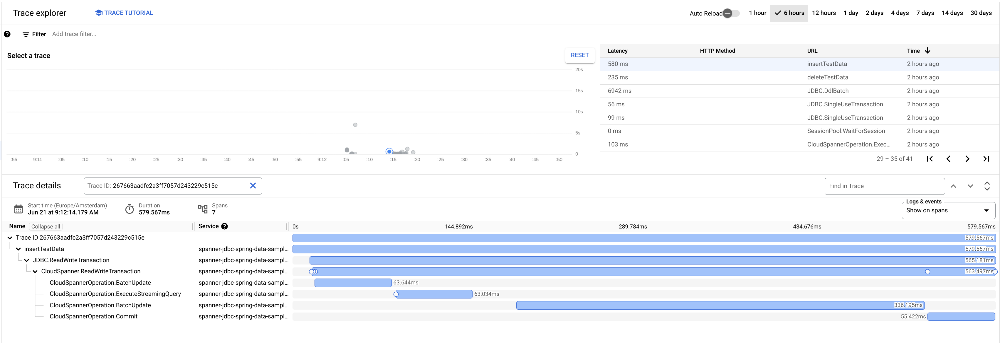
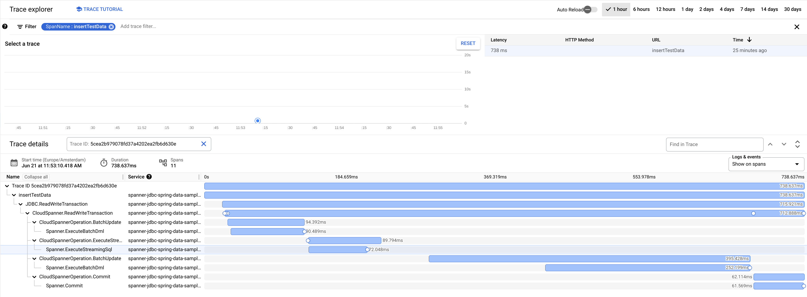
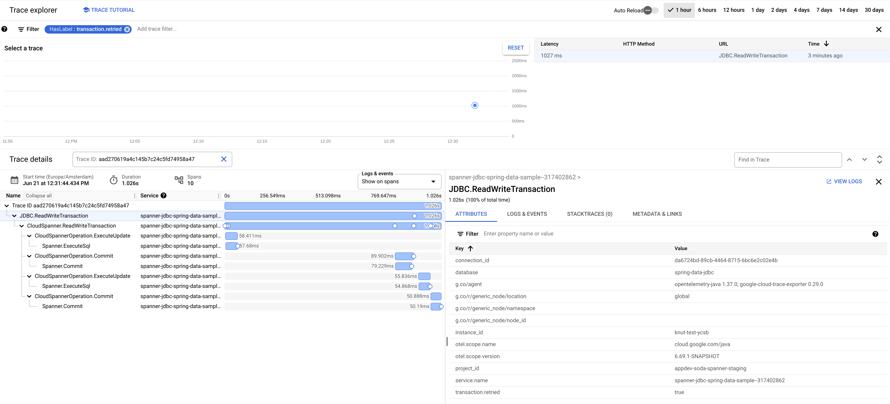
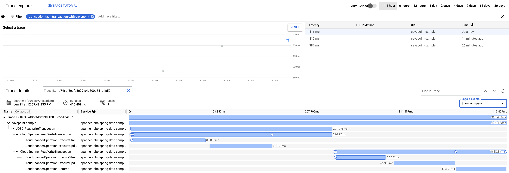
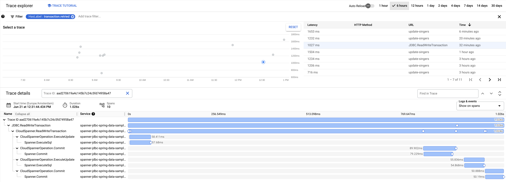
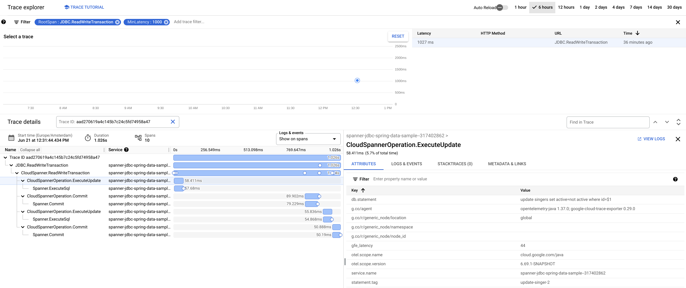

# Spanner JDBC Driver - Latency Debugging Guide

The Spanner JDBC driver supports OpenTelemetry tracing. Tracing can be used to investigate slow
queries and transactions and to determine whether transactions or requests are being retried. In
addition, all metrics described in [Latency points in a Spanner request](https://cloud.google.com/spanner/docs/latency-points)
are also collected by the JDBC driver and can be used for debugging.

## Configuration

You can configure the OpenTelemetry instance that should be used in two ways:
1. Register a global OpenTelemetry instance. This instance will automatically be picked up by the Spanner JDBC driver.
2. Add an OpenTelemetry instance with the key `openTelemetry` to the `java.util.Properties` instance that is used to create the JDBC connection.

The OpenTelemetry instance that you use for the JDBC driver can be the same as an instance that you
use for the application. The traces that are created by the JDBC driver will then become child spans
of the traces that your application produces.

By default, the traces that are generated by the Spanner JDBC driver do not include the SQL
statement. You can include the SQL statement with the traces by adding the property `enableExtendedTracing=true`
to the JDBC connection URL.

Tip: You can also enable extended tracing by setting the environment variable `SPANNER_ENABLE_EXTENDED_TRACING=true`

### Api Tracing

The traces that are generated by the JDBC driver by default stop at the level of a statement that is
executed by the JDBC driver. One statement is normally translated to one RPC call. However, there
can be additional RPC calls being executed in the following cases:
1. The JDBC driver inlines the `BeginTransaction` call with the first statement in a transaction.
   This is not possible in specific cases, such as if a transaction only contains mutations, or if
   the first statement in a transaction returns an error. In those cases, the JDBC driver executes
   and additional `BeginTransaction` RPC.
2. The JDBC driver retries RPCs that return `UNAVAILABLE` errors. These retries are transparent to
   the caller, and the observed behavior from the outside is that the statement execution took a
   longer time than expected. Enable API tracing to get insights into whether an RPC was retried or
   not.

You can enable API tracing by adding the property `enableApiTracing=true` to the JDBC connection URL.

Tip: You can also enable API tracing by setting the environment variable `SPANNER_ENABLE_API_TRACING=true`

### Example Using Global OpenTelemetry
Create and register a global OpenTelemetry object before creating a JDBC connection.
See also the [Spring Data JDBC Sample](../samples/spring-data-jdbc) for an example for how to
configure OpenTelemetry in combination with Spring Data.

```java
TraceConfiguration traceConfiguration = TraceConfiguration.builder().setProjectId("my-project").build();
SpanExporter traceExporter = TraceExporter.createWithConfiguration(traceConfiguration);
OpenTelemetry openTelemetry =
    OpenTelemetrySdk.builder()
        .setTracerProvider(
            SdkTracerProvider.builder()
                .setSampler(Sampler.traceIdRatioBased(0.05))
                .setResource(
                    Resource.builder()
                        .put("service.name", "my-unique-service-name")
                        .build())
                .addSpanProcessor(BatchSpanProcessor.builder(traceExporter).build())
                .build())
        .buildAndRegisterGlobal();
String projectId = "my-project";
String instanceId = "my-instance";
String databaseId = "my-database";
// Setting this to true instructs the JDBC driver to include the SQL statement with the traces.
boolean enableExtendedTracing = true;

try (Connection connection =
   DriverManager.getConnection(
       String.format(
           "jdbc:cloudspanner:/projects/%s/instances/%s/databases/%s?enableExtendedTracing=%s",
           projectId, instanceId, databaseId, enableExtendedTracing))) {
 try (Statement statement = connection.createStatement()) {
   try (ResultSet rs = statement.executeQuery("SELECT CURRENT_TIMESTAMP()")) {
     while (rs.next()) {
       System.out.printf(
           "Connected to Cloud Spanner at [%s]%n", rs.getTimestamp(1).toString());
     }
   }
 }
}
```

### Example Using an OpenTelemetry instance in Properties
Create an OpenTelemetry object and supply it as part of the properties for a JDBC connection.

```java
TraceConfiguration traceConfiguration = TraceConfiguration.builder().setProjectId("my-project").build();
SpanExporter traceExporter = TraceExporter.createWithConfiguration(traceConfiguration);
OpenTelemetry openTelemetry =
    OpenTelemetrySdk.builder()
        .setTracerProvider(
            SdkTracerProvider.builder()
                .setSampler(Sampler.traceIdRatioBased(0.05))
                .setResource(
                    Resource.builder()
                        .put("service.name", "my-unique-service-name")
                        .build())
                .addSpanProcessor(BatchSpanProcessor.builder(traceExporter).build())
                .build())
        .build();
String projectId = "my-project";
String instanceId = "my-instance";
String databaseId = "my-database";
// Setting this to true instructs the JDBC driver to include the SQL statement with the traces.
boolean enableExtendedTracing = true;

Properties properties = new Properties();
properties.put(JdbcDriver.OPEN_TELEMETRY_PROPERTY_KEY, openTelemetry);
properties.put("enableExtendedTracing", String.valueOf(enableExtendedTracing));

try (Connection connection =
   DriverManager.getConnection(
       String.format(
           "jdbc:cloudspanner:/projects/%s/instances/%s/databases/%s",
           projectId, instanceId, databaseId), properties)) {
 try (Statement statement = connection.createStatement()) {
   try (ResultSet rs = statement.executeQuery("SELECT CURRENT_TIMESTAMP()")) {
     while (rs.next()) {
       System.out.printf(
           "Connected to Cloud Spanner at [%s]%n", rs.getTimestamp(1).toString());
     }
   }
 }
}
```

## Traces

The Spanner JDBC driver produces traces for each statement that is executed on Spanner. The
hierarchy of those traces are as follows:
1. The transaction that was created by the JDBC driver. All of these transactions contain the
   attribute `connection_id`, which is a uniquely generated identifier for each JDBC connection.
   This identifier can be used to search for all transactions that have been executed by a specific
   connection. All JDBC transaction traces are prefixed with `JDBC.`. The transaction type is one of:
   1. `JDBC.SingleUseTransaction`: These transactions are created by the JDBC driver when a
      a statement is executed in auto-commit mode.
   2. `JDBC.ReadWriteTransaction`: Read/write transactions that can contain multiple queries and
      DML statements.
   3. `JDBC.ReadOnlyTransaction`: Read-only transaction that can contain multiple queries.
   4. `JDBC.DdlBatch`: A batch of DDL statements.
   
   The JDBC transaction trace contains the following attributes:
   1. `connection_id`: A randomly generated unique identifier for the JDBC connection that executed
      the transaction.
   2. `transaction.retried`: This attribute is added to the transaction trace if the transaction was
      aborted by Spanner and retried by the Spanner JDBC driver. It is not added to transactions
      that are not retried.
2. The transaction that was created by the Spanner client library. These are named
   `CloudSpanner.ReadWriteTransaction` and `CloudSpanner.ReadOnlyTransaction`. This is normally a
   one-to-one mapping with the transaction that the Spanner JDBC driver created, except if the JDBC
   transaction created a `Savepoint` and rolled back to that `Savepoint`. A transaction trace 
   includes the following attributes:
   1. `transaction.tag`: Any transaction tag that was set for the transaction.
3. The statements that were executed as part of the transaction. Statement traces include the
   following attributes:
   1. `statement.tag`: Any statement tag that was set for that statement.
   2. `db.statement`: The SQL string of the statement. This attribute is only added if
      `enableExtendedTracing=true` has been added to the JDBC connection URL. The attribute contains
      an array of SQL strings if the statement was a batch of DML statements. Note that Google Cloud
      Tracing limits attribute values to at most 256 bytes. SQL strings that are longer than this
      limit are truncated.
   3. `gfe_latency`: The execution time of the statement in milliseconds as measured by the Google
      Front End. This value can be seen as the 'server-side latency' of the statement. A large
      difference between this value and the execution time measured client side could be an
      indication that the network connection between the application and Spanner is slow.

The following screenshot shows an example of a traced read/write transaction that was executed by
the Spanner JDBC driver.



### API Tracing

API tracing adds traces for each RPC that is executed by the JDBC driver. This gives you insights
into RPC retries.

Enable API tracing by adding the property `enableApiTracing=true` to the JDBC connection URL or set
the environment variable `SPANNER_ENABLE_API_TRACING=true`.

The API traces contain the following attributes:

1. `attempt.count`: The RPC attempt. This is 1 for the initial attempt. A value higher than 1
   indicates that the RPC was retried.
2. `total_response_count`: This attribute is only added to streaming RPCs and indicate the number of
   streaming results the RPC returned. This property can for example be used to inspect the number
   of `PartialResultSet` instances that was returned by a `ExecuteStreamingSql` call.

This screenshot shows the same transaction as above with API tracing enabled.



## Aborted Transactions

The Spanner JDBC driver automatically retries read/write transactions that are aborted by Spanner.
These retries are transparent to the application, and the only indication that the application gets
that a transaction might have been retried, is that the transaction execution time is higher than
when it is not retried. The OpenTelemetry traces can be used to investigate transactions that were
retried. These transactions have a `transaction.retried:true` attribute. This can be used to search
for traces of transactions that were aborted.

This screenshot shows an example of a transaction that was aborted and retried. In this case, API
tracing was also enabled.



## Searching

The attributes that are added to traces can be used to search for traces of specific transactions,
transactions that show problematic behavior, and transactions that are retried.

The examples in this guide assume that the OpenTelemetry traces are exported to Google Cloud Trace.
The traces can also be exported to any other tracing solution that has an OpenTelemetry exporter.
Consult the documentation of the tracing solution of your choice for more information on how to
search for traces with specific attributes.

### Search for transaction or statement tag

See [this sample](https://cloud.google.com/spanner/docs/getting-started/jdbc#transaction_tags_and_request_tags)
for how to set transaction tags and statement tags with the Spanner JDBC driver.

The JDBC driver adds the attributes `transaction.tag` and `statement.tag` to respectively the
transactions and statements that it executes. These attributes can be used to search for all traces
of transactions and statements with specific tags. The Google Cloud Trace UI allows you to search
for such traces by entering the following as a trace filter:

```
transaction.tag:my_transaction_tag
```



### Search for aborted transactions

The `transaction.retried` attribute is added to transactions that are aborted by Spanner and retried
by the JDBC driver. You can search for these transactions with the filter `HasLabel:transaction.retried`.



## Backend Latency vs Client Latency

The traces that are generated by the Spanner JDBC driver show the end-to-end latency for executing
a statement. This includes the network latency between the client application and Spanner. You can
use the `gfe_latency` attribute of the `CloudSpannerOperation.*` traces to inspect the difference
between the two. This can be used to determine whether the latency of a statement is mainly caused
by network transport time or server execution time.

Click on a `CloudSpannerOperation.*` trace to open the attributes of that trace. The `gfe_latency`
attribute contains the total execution time of the statement as measured by the Spanner front end.
If this value is significantly lower than the total trace time, then that could be an indication of
a slow network connection between your application and Spanner.

In the example screenshot below the `gfe_latency` is 44ms, while the trace time is 58.411ms.
The 14ms difference between the two indicates that the network connection between the client
application and Spanner is slow and/or that the client application is located geographically far
away from the Spanner instance.


